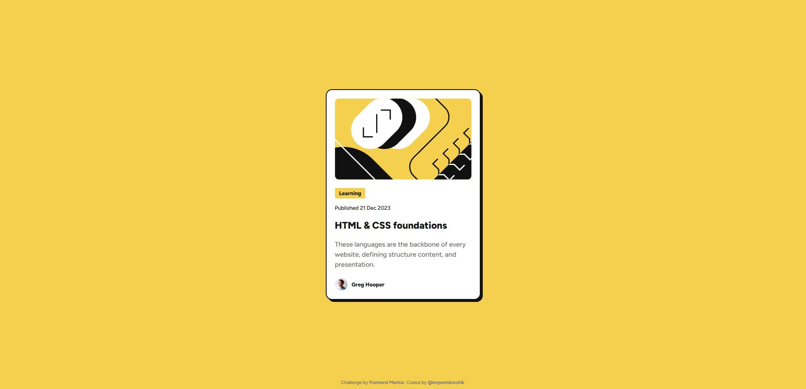

# Frontend Mentor - Blog preview card solution

This is a solution to the [Blog preview card challenge on Frontend Mentor](https://www.frontendmentor.io/challenges/blog-preview-card-ckPaj01IcS). Frontend Mentor challenges help you improve your coding skills by building realistic projects.

## Table of contents

- [Overview](#overview)
  - [The challenge](#the-challenge)
  - [Screenshot](#screenshot)
  - [Links](#links)
- [My process](#my-process)
  - [Built with](#built-with)
  - [What I learned](#what-i-learned)
- [Author](#author)

## Overview

### The challenge

Users should be able to:

- See hover and focus states for all interactive elements on the page

### Screenshot



### Links

- Live Site URL: [Blog Preview Card](https://mrpomidorchik.github.io/blog-preview-card-main/)

## My process

### Built with

- Semantic HTML5 markup
- CSS custom properties
- Flexbox

### What I learned

```css
@font-face {
  font-family: "Figtree";
  src: url(./assets/fonts/static/Figtree-Medium.ttf) format("truetype");
  font-weight: 500;
  font-style: normal;
  font-display: swap;
}
```

## Author

- Telegram - [@mrpomidorchik](https://t.me/mrpomidorchik)
